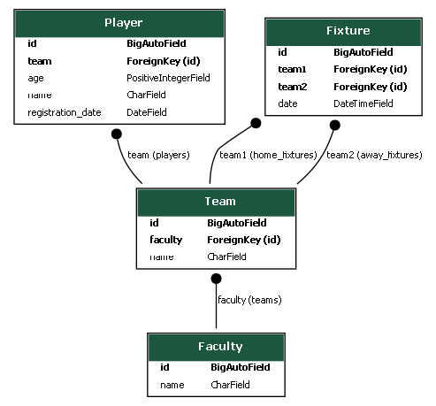

# TorneoPro: Plataforma de Gestión de Torneos Deportivos

**TorneoPro** es una aplicación web de arquitectura desacoplada diseñada para modernizar y automatizar la gestión de torneos deportivos en el ámbito universitario. Este proyecto reemplaza los procesos manuales propensos a errores con una plataforma centralizada, eficiente y escalable.

**[➡️ Ver la aplicación en vivo](https://effervescent-otter-d7649c.netlify.app/)**

---

## 📜 Sobre el Proyecto

Este proyecto fue desarrollado como parte del curso de Programación Web 2 en la Universidad Nacional de San Agustín. El trabajo completo, incluyendo la justificación de diseño y los detalles de implementación, se encuentra documentado en nuestro **[artículo científico en formato IEEE](Anexo_ProcesoDesarrollo/INFORME_IEEE_DEL_PROYECTO.pdf)**.

La plataforma aborda los desafíos comunes de la gestión de eventos deportivos, como la inconsistencia de datos, la comunicación ineficiente y la alta carga administrativa, ofreciendo una solución digital integral.

## ✨ Funcionalidades Clave

*   **Autenticación Segura:** Registro de usuarios con verificación por correo y sistema de login basado en JSON Web Tokens (JWT).
*   **Gestión de Entidades:** API RESTful completa para administrar Facultades, Equipos, Jugadores y Partidos (Fixtures).
*   **Generación Automática de Fixtures:** Un algoritmo round-robin crea el calendario de competición con un solo clic.
*   **Exportación a PDF:** Los usuarios pueden descargar el calendario de partidos en formato PDF para su conveniencia.
*   **Interfaz Reactiva:** Un frontend dinámico y responsivo que ofrece una experiencia de usuario fluida en cualquier dispositivo.
*   **Despliegue Automatizado (CI/CD):** Flujo de trabajo de integración y despliegue continuo a través de Vercel y Netlify.

## 🏛️ Arquitectura del Sistema

El proyecto sigue una arquitectura desacoplada (headless), donde el frontend y el backend son aplicaciones independientes que se comunican a través de una API.

*   **Backend (API RESTful):**
    *   **Framework:** Django y Django REST Framework.
    *   **Base de Datos:** PostgreSQL, gestionada a través de Supabase.
    *   **Despliegue:** Vercel (Serverless Functions).

*   **Frontend (Single Page Application):**
    *   **Framework:** Angular y Tailwind CSS.
    *   **Despliegue:** Netlify.

## 🚀 Cómo Empezar (Guía de Instalación)

Sigue estos pasos para correr el proyecto en un entorno de desarrollo local.

### Prerrequisitos

*   Python 3.8+ y Pip
*   Node.js y npm
*   Una instancia de PostgreSQL (puedes usar un proyecto gratuito de Supabase)

### 1. Configuración del Backend
# 1. Clona el repositorio
git clone https://github.com/DavidOliva06/projectoFinalPweb2DataBase.git
cd tu-repositorio/Backend

# 2. Crea y activa un entorno virtual
python -m venv venv
# Windows:
venv\Scripts\activate
# macOS/Linux:
source venv/bin/activate

# 3. Instala las dependencias
pip install -r requirements.txt

# 4. Configura tus variables de entorno
  - Crea un archivo .env en la raíz del Backend
   - Añade tus credenciales de base de datos, SECRET_KEY, etc.
    (ver .env.example para la estructura)

# 5. Aplica las migraciones
python manage.py migrate

# 6. Inicia el servidor
python manage.py runserver
El backend estará corriendo en http://127.0.0.1:8000.

### 2. Configuración del Frontend

# 1. Navega a la carpeta del frontend en una nueva terminal
cd ../Frontend/torneo-app

# 2. Instala las dependencias
npm install

# 3. Configura la URL de la API
  - Abre src/app/api.config.ts y asegúrate de que la URL apunte a tu servidor local.

# 4. Inicia el servidor de desarrollo
ng serve -o
El frontend estará corriendo en http://localhost:4200

## 👨‍💻 Autores
David Alexander Oliva Valdivia - doliva@unsa.edu.pe 
Edson Fabricio Subia Huaicane - esubiahu@unsa.edu.pe 

## 📜 Licencia

Este proyecto está licenciado bajo los términos de la Licencia MIT. Consulta el archivo `LICENSE` para más detalles.

---

## 🤝 Contribuciones

Las contribuciones son bienvenidas y son la mejor forma de hacer crecer y mejorar la comunidad. Si tienes una idea para mejorar este proyecto, por favor sigue estos pasos:

1.  **Haz un Fork** del proyecto.
2.  **Crea una nueva rama** para tu funcionalidad (`git checkout -b feature/AmazingFeature`).
3.  **Haz tus cambios** y commitea (`git commit -m 'feat: Add some AmazingFeature'`).
4.  **Sube tu rama** al repositorio (`git push origin feature/AmazingFeature`).
5.  **Abre un Pull Request**.

## 🙏 Agradecimientos

Queremos expresar nuestro agradecimiento a:

*   Nuestros docentes del curso de **Programación Web 2**, el **Ing. Carlo Corrales** y el **Ing. Richart Escobedo**, por su invaluable guía, apoyo y mentoría a lo largo de todo el desarrollo de este proyecto.
*   La **Universidad Nacional de San Agustín** y la **Escuela Profesional de Ingeniería de Sistemas** por fomentar un entorno académico que hizo posible esta iniciativa.
*   Las increíbles comunidades de código abierto detrás de Django, Angular y todas las herramientas que sustentan "TorneoPro".
